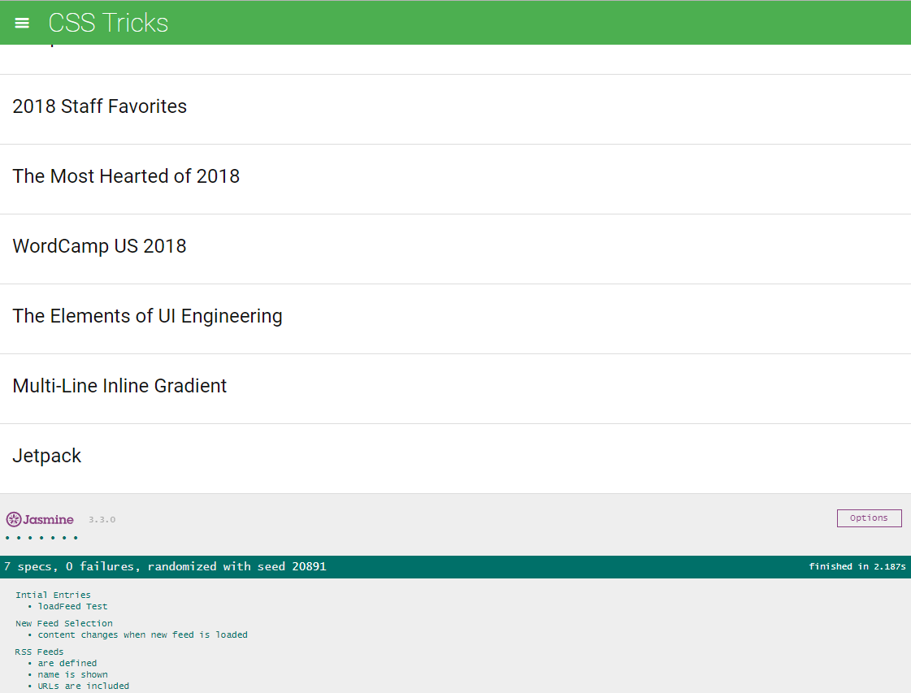

# Project Overview

# Project Overview

In this project I was given a web-based application that reads RSS feeds. The original developer of this application clearly saw the value in testing, they've already included [Jasmine](http://jasmine.github.io/) and even started writing their first test suite! Unfortunately, they decided to move on to start their own company and we're now left with an application with an incomplete test suite. That's where I developed my tests to complete the project.

## Why this Project?

Testing is an important part of the development process and many organizations practice a standard of development known as "test-driven development." This is when developers write tests first, before they ever start developing their application. All the tests initially fail and then they start writing application code to make these tests pass.

Whether you work in an organization that uses test-driven development or in an organization that uses tests to make sure future feature development doesn't break existing features, it's an important skill to have!

## What will did I learn?

You will learn how to use Jasmine to write a number of tests against a pre-existing application. These will test the underlying business logic of the application as well as the event handling and DOM manipulation.

## How will this help my career?

Writing effective tests requires analyzing multiple aspects of an application including the HTML, CSS and JavaScript - an extremely important skill when changing teams or joining a new company.

Good tests give you the ability to quickly analyze whether new code breaks an existing feature within your codebase, without having to manually test all of the functionality.
#  How the tests work

The application's opening /viewing point is at index.html. Download this file, within the zip file is the index.html file that will need to be opened within a browser. Once opened Jasmine will automatically the designed tests. These will be situated at the bottom of the page within the browser. They will be shown as green with the specs and failures if present.

Within the test file you are able to navigate to jasmine/spec/feedreader.js which can be viewed with a text editor.

I have used comments to outline what each test is doing, I will briefly outline what did occur in this README.

1. The first test is focused on looping through each feed within allFeeds to check whether or not there was a URL or a name stored within them. This was done with the For of loop which was able to create a loop through the Array. Each test ended up passing as there was content. I also checked when data was removed if i got a red light which did occur.

2. The Second test was focused on the menu, it was testing whether or not the menu was hidden by default, this was within the CSS class so this could be referenced. The second part of the test was focused on creating a click command which was then linked to a check on whether or not the menu was hidden initially, and then when clicked then a true statement would follow indicating it was in fact clicked and displayed.

3. The third test is focused around checking whether or not when the loadFeed function is complete if there is in fact one or more entries within the .feed container. We test if each child of .feed has a length greater than 0. This will give us the answer we are looking for. As the API runs there is an item which is added to the feed container with a feed item from the Handlebars entryTemplate.

4. The last test was the trickiest, I first had to create a load function to load the first entry, then the second which would be stored in a variable. I changed this from the previous entry that wasn't running the asynchronous function correctly. The first call is defined and loaded then test this against new feed that is loaded.
Once loaded I test whether or not the second and first feed match. Indicating that they should not.

5. Additional detail is stored within Comments throughout the tests **

# Running the Application

1. Download the repo off Github.

2. The application's opening /viewing point is at index.html. Download this file, within the zip file is the index.html file that will need to be opened within a browser. Once opened Jasmine will automatically the designed tests. These will be situated at the bottom of the page within the browser. They will be shown as green with the specs and failures if present.

Within the test file you are able to navigate to jasmine/spec/feedreader.js which can be viewed with a text editor.
